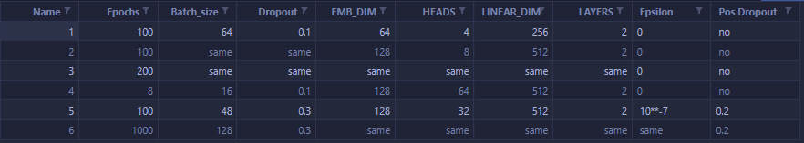

# Transformer implementation in pytorch

This is the application of [Attention is all you need](https://proceedings.neurips.cc/paper_files/paper/2017/file/3f5ee243547dee91fbd053c1c4a845aa-Paper.pdf).
Although during the training, a simple dropout layer is added after the Positional Embeddings is added to the words embeddings. The training is just a small experiment of translating from english to german with only about 10k data points in the dataset. 

The dropout layer after Positional Embeddings was added just to make the model more generalized. 

Plots of the training:

### 1

Validation loss seems pretty high. 
### 2

Validation loss dips at early epochs but soon gets to the same trend. 

### 3

Validation loss dips at early epochs but gradually increases at later epochs. Sign of overfitting.

### 4

A closer look of training for the first 8 epochs. The accuracy seems to be very similar. The validation loss is diverging rapidly from the training loss. 

### 5 

After increasing dropout to 0.3 and heads decreased to 32, the validation loss decreased to 1.75. 

### 6

Training for 100 epochs. Validation loss did not decrease. 

Summary of the hyperparameters:

Not a very good example of attention:

